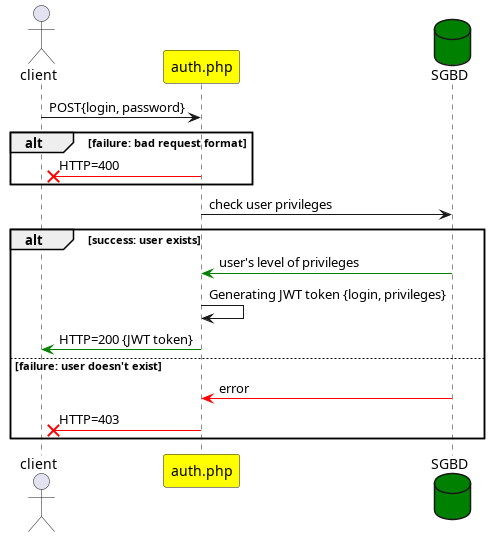
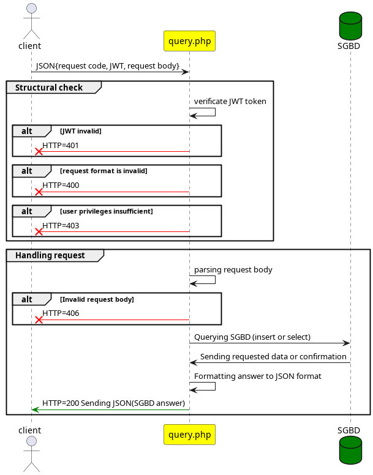
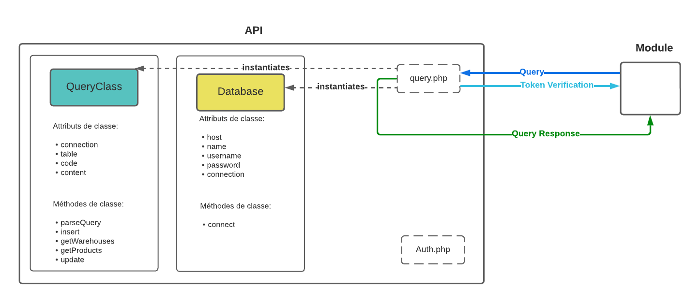
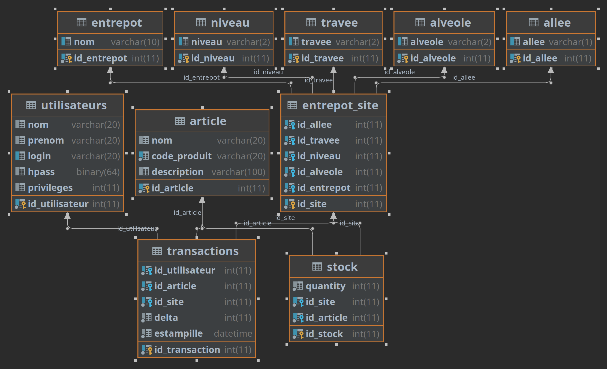

= API Mamazon
Léo Chéneau
v1.2 2022-11-15
:doctype: report
:toc: macro
:toc-title: Tables des matières
:toclevels: 3
:source-highlighter: rouge
:stem: latexmath
:data-uri:

API d'intercommunication entre les interfaces et le backend.

== Entrées / Sorties

=== JSON

Les entrées se font **toujours** en _JSON_.

Format d'un message à l'API.

[source, json]
----
{
    "code": 0, /* int: API code */
    "token": "xxxx", /* string: JWT token */
    "content": {
        /* request content */
        "property": value
    }
}
----

Les réponses sont au format JSON si succès.

=== Pages

L'API est comprise de deux pages :

* `auth.php` pour l'authentification.
 
* `query.php` script qui se connecte à une bdd, exécute une requête, et envoie une réponse JSON

=== Erreurs

Une erreur sera signifiée par un code d'erreur HTTP 4XX.

=== Connexion et sécurité

Afin de garantir la sécurité, les clients doivent s'authentifier via la page `auth.php` et récupérer un https://jwt.io/[JWT]. Ces accès se font via une connexion TLSv3. Les champs `username` et `password` sont à envoyer par requête POST. La page répond un JWT brut (texte) si les informations sont correctes et renvoie une erreur dans le cas contraire.

Pour des raisons de sécurité, les mots de passe seront salés et stoqués sous forme d'un condensat SHA3-512.

=== Requêtes

Les requêtes sont à envoyer au format JSON à la page `query.php`. Toute requête doit posséder un champ _code_ et _token_ (obtenu depuis `auth.php`). Le serveur répond par un fichier JSON ou bien par une erreur si un problème est survenu.

=== Enregistrement des transactions

Toute modification de stock est enregistrée, ainsi que l'utilisateur en étant à l'origine, dans une table `transaction`.

==== Exécution normale
La page `query.php` reçoit la requête. Le Token est vérifié et une réponse est envoyée au format JSON. +
Si le Token est valide, une instance de Database et de Query sont créées. La requête est parsée dans la classe Query par la méthode ParseQuery qui fait appel à la méthode correspondante selon le code de la requête (insert, getWarehouses, getProducts ou update). + 
La méthode retourne le résultat sous format `array`. Ce résultat est encodé sous format JSON dans la page `query.php` et envoyé.

== Accès direct au SGBD

Le SGBD est une base de données MariaDB, contacter @cheneau pour les accès directs.

Seule l'équipe BI possède un accès direct à la base de données, il est en lecture seule.

== Liste des requêtes et réponses

=== Introduction

Chaque type requête et chaque type de réponse possède un code. Les requêtes possèdent un code impair, les réponses des codes pairs. +
Ce code est présent dans le champ `code` au niveau le plus élevé du JSON.
Chaque requête doit posséder un champ `token` contenant un JWT obtenu depuis la page **auth.php**.

Les champs mentionnés plus bas sont ceux du super-champ `content`.

=== Réponse du serveur à création (code 0)

Réponse renvoyée par le serveur après une tentative de création.

NOTE: Si tout s'est bien passé le code HTTP 200 est envoyé. Dans ce cas, il n'est pas nécessaire de parser cette réponse.

.Champs
|===
| **Nom** | Type | Valeur
| success | _int[0 ou 1]_ | Succès de l'opération, 1 = succès, 0 = échec
| message | _string_ | Message contenant plus d'informations
|===

.Exemple
****
[source, json]
----
{
    "code": 0,
    "content": {
    	"success": 0,
	"message": "Invalid token"
    }
}
----
****

=== Création d'un objet (code 1)

Requête ajoutant un nouvel objet (abstrait) à la table des articles.

.Champs
|===
| **Nom** | Type | Valeur
| product | _string_ | code produit
| name	  | _string_ | nom produit
| description | _string_ | description produit
|===

.Exemple
****
[source, json]
----
{
    "code": 1,
    "token": "VALID",
	"content": {
		"product": "E961307",
		"name" : "nom produit",
		"description" : "description produit"
		}
    }
}
----
****

=== Réponse du serveur à la demande des noms d'emplacements (code 2)

Réponse renvoyée par le serveur après une demande des noms d'entrepôts.

.Champs
|===
| **Nom** | Type | Valeur
| list | _array[string]_ | Liste des noms
|===

.Exemple
****
[source, json]
----
{
    "code": 2,
    "content": {
    	"list": [
		"A",
		"B"
	]
     }
}
----
****

=== Demande des noms des emplacements (code 3)

Demande le nom des entrepôts, allee, travee, niveau ou alveoles

.Champs
|===
| **Nom** | Type | Valeur
| type | _string_ | warehouse / allee / travee / niveau / alveoles
|===

Le serveur répond avec un JSON de code 2.

.Exemple
****
[source, json]
----
{
    "code": 3,
    "token": "VALID",
    "content": {
		"type" : "warehouse"
    }
}
----
****

=== Réponse du serveur à la demande des produits (code 4)

Réponse renvoyée par le serveur après une demande des produits présents dans un entrepôt.

.Champs
|===
| **Nom** | Type | Valeur
| list | _array[array]_ | Liste des Produits
| list[N].product | _id_ | Code produit
| list[N].name | _string_ | Nom du produit
| list[N].quantity | _int_ | Quantité à cet endroit
| list[N].location | **array** | emplacement
| list[N].location.warehouse | _string_ | Code magasin
| list[N].location.allee | _string_ | allée
| list[N].location.travee | _string_ | travée
| list[N].location.niveau | _string_ | niveau
| list[N].location.alveole | _string_ | emplacement dans l'avéole
|===

.Exemple
****
[source, json]
----
{
    "code": 4,
    "content": {
    	"list": [
		{
			"code": "E961307",
			"name": "rollers",
			"quantity": 100,
			"location": {
				"warehouse": "MAG1",
				"allee": "A",
				"travee": "02",
				"niveau": "02",
				"alveole": "03"
			},
		/* autre produit */
	]
     }
}
----
****

=== Demande d'informations sur les produits (code 5)

Demande le nom des entrepôts (warehouse)

.Champs
|===
| **Nom** | Type | Valeur
| product | _string_ | Code produit ou `*`
| location | **JSON** | emplacement
| location.warehouse | _string_ | Code magasin ou `*`
| location.allee | _string_ | allée ou `*`
| location.travee | _string_ | travée ou `*`
| location.niveau | _string_ | niveau ou `*`
| location.alveole | _string_ | emplacement dans l'avéole ou `*`
|===

Le serveur répond avec un JSON de code 4.

.Exemple
****
[source, json]
----
{
    "code": 5,
    "token": "VALID",
    "content": {
		"location": {
			"warehouse": "MAG1",
			"allee": "*",
			"travee": "*",
			"niveau": "*",
			"alveole": "*"
		},
		"product": "*",
    }
}
----

Cet exemple extrait tous les produits de l'entrepot _MAG1_.
****

=== Ajustement de stock (code 7)

Requête ajustant un objet présent dans le stock (ajout (quantity > 0) ou retrait (quantity < 0) ). Si l'object n'est pas présent, on le créé dans le stock.

Le serveur répond avec un JSON de code 6.

.Champs
|===
| **Nom** | Type | Valeur
| location | **array** | emplacement
| location.warehouse | _string_ | Code magasin
| location.allee | _string_ | allée
| location.travee | _string_ | travée
| location.niveau | _string_ | niveau
| location.alveole | _string_ | emplacement dans l'avéole
| product | _string_ | code produit
| quantity | _int_ | Nouvelle quantité
|===

.Exemple
****
[source, json]
----
{
    "code": 7,
    "token": "VALID",
    "content": {
		"location": {
			"warehouse": "MAG1",
			"allee": "A",
			"travee": "02",
			"niveau": "02",
			"alveole": "03"
		},
		"product": "E961307",
		"quantity": 50
    }
}
----
****
=== Création de localisation (code 9)

Requête permettant de créer un endroit dans l'entrepot(warehouse, allee, travee, niveau, alveole)
Le serveur répond avec un JSON de code 8.

.Champs
|===
| **Nom** | Type | Valeur
| space | _int_ | type endroit (warehouse / allee / travee / niveau / alveole)
| name | _string_ | nom endroit
|===

.Exemple permettant de créer une travée
****
[source, json]
----
{
    "code": 9,
    "token": "VALID",
    "content": {
		"space": "travee",
		"name": "XX"
    }
}
----
****

Le serveur répond avec un JSON de code 8.

.Exemple
****
[source, json]
----
{
    "code": 8,
    "content": {
    	"success": 0,
	"message": "Invalid token"
    }
}
----
****

=== Informations sur un produit (code 11)

Requête permettant de récupérer toutes les informations sur un produit
Le serveur répond avec un JSON de code 10.

.Champs
|===
| **Nom** | Type | Valeur
| code | _string_ | code produit
|===

.Exemple permettant de créer une travée
****
[source, json]
----
{
    "code": 9,
    "token": "VALID",
    "content": {
		"code": "Y345868"
    }
}
----
****

Le serveur répond avec un JSON de code 10.

.Exemple
****
[source, json]
----
{
    "code": 10,
    "content": {
    	"id_article": 1,
		"code": "Y345868",
		"name": "Nom Produit",
		"description" : "description"
    }
}
----
****

== Architecture de l'API

Cette section détaille les différentes pages de l'API **pour les développeurs de l'API**. Ces pages ne sont pas toutes publiques.

=== Architecture

* `static` : Contient les pages accessibles à l'utilisateur final.

** `auth.php` : Page chargée de l'authentification. (Voir plus haut)

** `static/include` : Dossier contenant des fonctions, classes et variables utiles. tout son contenu est **non accessible à l'utilisateur de l'API.

*** `static/include/bdd.php` : Header à inclure pour se connecter à la BDD. Il exporte un objet _PDO_ nommé `$pdo` permettant d'accéder au SGBD.

*** `static/include/secrets.php` : Header chargé de charger les secrets (clés RSA, etc.) depuis l'environnement. Exporte les variables `$private_key` et `public_key`.

*** `static/include/config.php` : Header définissant les paramètres globaux du serveur (exception, etc.). **À inclure dans toutes les pages publiques**.

*** `static/include/jwt.php` : Header définissant les fonctions liées au JWT. Exporte les fonctions `parse_token`, et `create_token`.

* `secrets` : Dossier contenant les fichiers sensibles. **Non accessible à l'utilisateur de l'API.**

=== Format du JWT

Le JWT est un fichier JSON classique sérializé en base 64. Il contient deux parties séparées par un caractère '.' : le header et le Payload.

Le contenu des JWT générés et lus par `auth.php` est décrit dans les parties suivantes.

Les champs utilisés sont standardisés et conformes à la link::https://www.rfc-editor.org/rfc/rfc7519[RFC 7519: JSON Web Token (JWT)].

==== Header

[source, json]
----
{
  "alg": "RS256",
  "typ": "JWT"
}
----
Tous les champs du header sont fixes. L'algorithme RS256 est utilisé et combine une clé RSA et un condensat SHA-256. C'est la link::https://stackoverflow.com/questions/51489637/what-are-the-differences-between-jwt-rs256-rs384-and-rs512-algorithms[Méthode recommandée].

==== Payload

[source, json]
----
{
  "iss": "mamazon.zefresk.com", /* fixe */
  "sub": "username",
  "uid": 154,
  "aud": "1",
  "iat": 1516239022,
  "exp": 1516239023,
  "jti": "deadbeef"
}
----

* `iss`: _issuer_, émetteur du JWT. Fixé à 'mamazon.zefresk.com'.

* `sub`: _subject_, nom d'utilisateur du récepteur.

* `uid`: _user ID_, entier correspondant à `id_utilisateur` du SGBD.

* `aud`: _audience_, niveau de privilèges du récepteur.

* `iat`: _issued at time_, timestamp du moment de l'émission du jeton.

* `exp`: _expire_, timestamp marquant la date de péremption du jeton.

* `jti`: _JWT ID_, identifiant héxadécimal aléatoire du jeton pour éviter les attaques par replay.

=== Modèle relationnel

nous nous sommes basés sur un modèle relationnel qui se compose de 10 tables interconnectées.

Pour créer une troisième forme normale dans la table **entrepot_site**, il faut s'assurer que tous les attributs de la table ne dépendent que de la clé primaire, et non pas d'une autre clé ou d'un groupe d'attributs non-clé.
Pour ce faire, on peut créer des tables distinctes pour les attributs qui sont liés à d'autres attributs dans la table entrepot_site, comme les tables **allee**, **alveole**, **travee** et **niveau**.
Ces tables seront liées à la table **entrepot_site** à l'aide de clés étrangères, ce qui permettra d'éliminer les dépendances entre les attributs non-clé dans la table entrepot_site. De cette manière, on pourra s'assurer que la table entrepot_site est dans la troisième forme normale.
